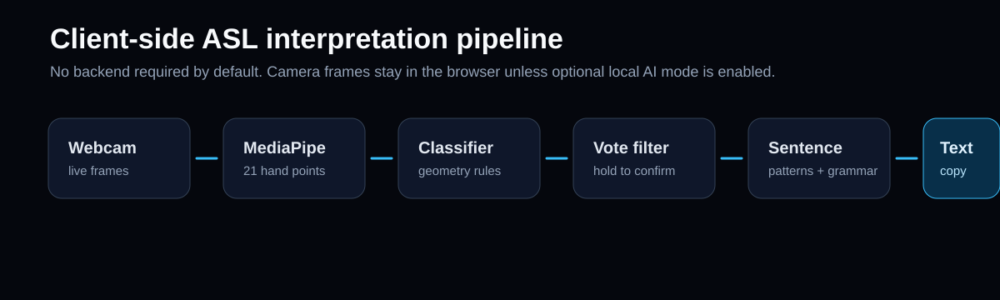

# ASL Interpreter

**A browser-based American Sign Language gesture interpreter that runs on the client.**

ASL Interpreter uses webcam hand tracking, geometric gesture heuristics, a vote-based stability filter, and a tested sentence-building engine to turn recognized ASL glosses into natural English output. It runs locally in the browser by default: no backend, no account, and no cloud API required.

## What It Does

- Detects one hand in real time with MediaPipe Hands.
- Draws a skeletal landmark overlay on top of the webcam feed.
- Classifies supported signs from landmark geometry.
- Requires signs to remain stable before registering them.
- Builds live English sentences from confirmed signs.
- Saves session transcript entries in the browser UI.
- Supports custom phrase mappings stored in `localStorage`.
- Offers optional local LLM sentence generation with rule-based fallback.

## Privacy Model

By default, camera frames stay in your browser. The app does not upload video and does not require a server. Optional AI mode can send recognized sign glosses, not video frames, to a local endpoint that you configure yourself.

## System Flow



```text
Webcam frame
  -> MediaPipe Hands landmark detection
  -> geometric sign classifier
  -> sliding vote queue + hold threshold
  -> confirmed sign buffer
  -> tested sentence engine
  -> live sentence + transcript
```

## Supported Signs

| Category | Signs |
| --- | --- |
| Numbers | `0`, `1`, `2`, `3`, `4`, `5`, `6`, `7`, `8`, `9` |
| Responses | `YES`, `NO`, `GOOD`, `SORRY`, `THANK YOU`, `PLEASE`, `HELLO` |
| Actions and verbs | `HELP`, `STOP`, `WANT`, `MORE`, `EAT`, `THINK`, `KNOW`, `LIKE`, `NEED`, `YOU` |
| People and phrases | `WATER`, `MOTHER`, `FRIEND`, `I LOVE YOU` |

The app is a prototype interpreter for a known vocabulary. It is not a full ASL translation system.

## Sentence Engine

The browser app now uses a separate tested core module at `src/asl-core.js`.

The engine resolves a sign sequence in this order:

1. User-defined custom phrase mappings.
2. Exact built-in phrase patterns.
3. Built-in subsequence matches for partial input.
4. Grammar fallback for unseen combinations.

Example:

```js
ASLCore.interpretSignsToSentence(['WANT', 'WATER', 'PLEASE'])
// { sentence: 'I want water, please.', intent: 'REQUEST_WATER', confidence: 0.95 }
```

## Run Locally

Clone the repo:

```bash
git clone https://github.com/Bouwles/ASL-Interpreter.git
cd ASL-Interpreter
```

Install nothing if you only want to run the browser app. Start a static server:

```bash
npx serve .
```

Then open the local URL in a browser and allow camera access.

Opening `index.html` directly may work, but a local server is more reliable for webcam permissions.

## Run Tests

The tested sentence-building logic does not need a browser:

```bash
npm test
```

The tests cover sentence formatting, phrase matching priority, custom phrase validation, and unsupported sign rejection.

## Optional Local AI Mode

AI mode is disabled by default. To use it:

1. Run a local text-generation endpoint, such as Ollama.
2. Open the Reference panel.
3. Enter the endpoint, for example `http://localhost:11434/api/generate`.
4. Enter the model name.
5. Toggle AI mode on.

If the request fails or times out, ASL Interpreter falls back to the tested rule-based sentence engine.

## Project Structure

```text
ASL-Interpreter/
|-- index.html                       # Browser UI, MediaPipe integration, camera loop
|-- src/
|   `-- asl-core.js                  # Tested sentence engine and phrase utilities
|-- tests/
|   `-- asl-core.test.js             # Node test suite
`-- docs/assets/                     # README preview and flow visuals
```

## Current Limitations

- The sign classifier is heuristic, not a trained ASL recognition model.
- Lighting, camera angle, hand size, and occlusion can affect recognition.
- The vocabulary is intentionally limited.
- ASL grammar is richer than the sentence fallback can represent.
- Optional AI mode sends text glosses to your configured local endpoint.

## Future Improvements

- Add a calibration flow for hand size and camera angle.
- Add a confidence timeline for debugging recognition quality.
- Train a small gesture classifier on recorded landmark samples.
- Add multi-hand support for signs that require both hands.
- Add a guided practice mode for each supported sign.

---

Made by Paul Nercessian.
